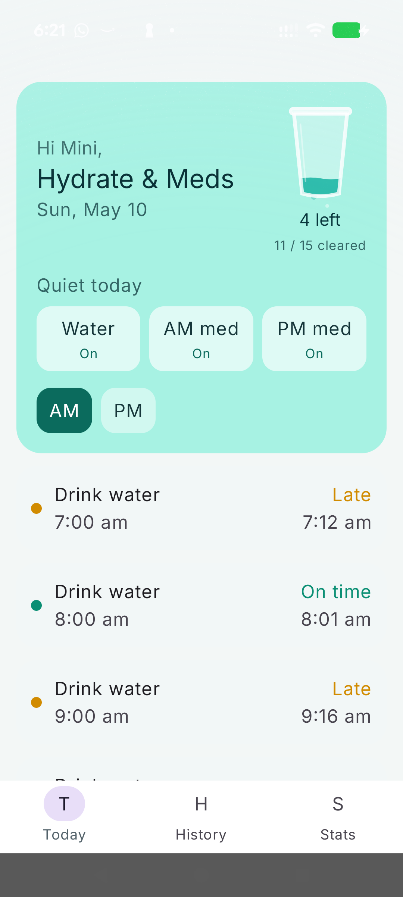
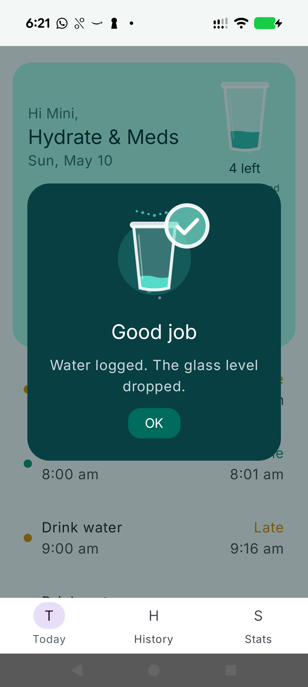
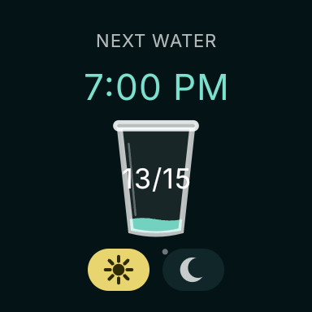

# Hydrate & Meds

A personal Android + Wear OS companion app for hourly water reminders and twice-daily medicine reminders.

The watch is the primary surface: quick glance progress, reminder takeovers, one-tap Done, and a Tile. The phone is the review surface: today's timeline, history, stats, pause controls, and a more detailed progress view.

This is intentionally a single-user app. There are no accounts, cloud sync, analytics, or schedule editing screens. The schedule lives in code so it can be tweaked safely in one place.

## Screenshots

<p>
  
  
  
</p>

## Reminder Schedule

The schedule is hardcoded in [`HydrateMedsScheduleConfig`](shared/src/main/java/dev/bhaarath/hydratemeds/shared/schedule/HydrateMedsScheduleConfig.kt).

- Water: every hour from 7:00 AM through 9:00 PM, for 15 reminders per day.
- Morning medicine: 10:00 AM.
- Evening medicine: 8:30 PM.
- Nag interval: 5 minutes.
- Times use the device's local timezone.

Acknowledgments store both the scheduled time and acknowledged time, so the app can show on-time, late, missed, and upcoming states.

## What It Does

- Exact local reminders using `AlarmManager`.
- Re-notification loop using `WorkManager`.
- Phone and watch both schedule reminders so the watch is not dependent on the phone being reachable.
- Watch-to-phone and phone-to-watch acknowledgment sync through the Wearable Data Layer.
- Custom voice clips for water and medicine reminders.
- Daily per-type pause controls: water, AM medicine, and PM medicine can be paused independently for the current day.
- Boot receiver reschedules reminders after reboot or app update.
- Phone UI includes today's timeline, history, stats, and a glass progress metaphor.
- Watch UI includes a compact round-screen-friendly progress view and Tile.

## Architecture

```text
Hydrate & Meds
|-- mobile   Android phone app, Compose Material 3
|-- wear     Wear OS app, Wear Compose + Tile
`-- shared   Schedule, models, Room, reminders, notifications, sync
```

The main flow is:

```text
Compose UI -> ViewModel -> Repository -> Room
                           -> AlarmManager / WorkManager
                           -> Wearable Data Layer
```

Hilt wires the app together. Room is the local source of truth on each device, with acknowledgments and daily pause state synced between phone and watch.

## Tech Stack

- Kotlin
- Gradle Kotlin DSL + version catalog
- Jetpack Compose on phone
- Wear Compose on watch
- Room
- Hilt
- AlarmManager
- WorkManager
- Wearable Data Layer API
- Inter variable font

Current SDK settings are managed in [`libs.versions.toml`](gradle/libs.versions.toml):

- `compileSdk`: 36
- phone `minSdk`: 31
- watch `minSdk`: 33
- `targetSdk`: 36

## Build

Open the project in Android Studio, or build from the repo root:

```bash
./gradlew :mobile:assembleDebug :wear:assembleDebug
```

Generated APKs:

```text
mobile/build/outputs/apk/debug/mobile-debug.apk
wear/build/outputs/apk/debug/wear-debug.apk
```

## Install

Phone:

```bash
adb -d install -r mobile/build/outputs/apk/debug/mobile-debug.apk
```

Pixel Watch over wireless debugging:

```bash
adb connect WATCH_IP:PORT
adb -s WATCH_IP:PORT install -r wear/build/outputs/apk/debug/wear-debug.apk
```

The phone and watch must be paired through Wear OS for Data Layer sync to work. Both apps still schedule local reminders independently.

## Custom Audio

The reminder voice clips live in:

```text
shared/src/main/res/raw/drink_water_appa.ogg
shared/src/main/res/raw/medicine_reminder.ogg
```

Replace those files with new clips using the same resource names if you want to update the voice prompts.

## Notes

- This is not built for Play Store release.
- There is no manual schedule editor by design.
- The repo includes debug-only receivers that help trigger and clean up local test reminders during development.
- Since this is a personal app, the code optimizes for reliability, clarity, and a polished daily-use interface over multi-user flexibility.
